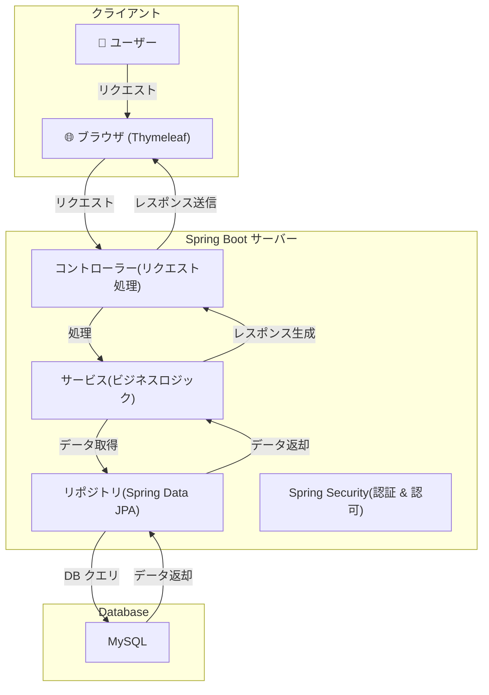
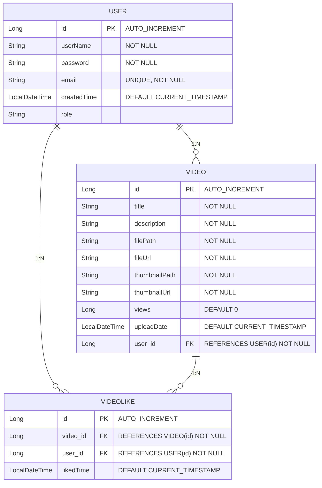

# 🎥 動画共有視聴システム (Video Sharing & Streaming System)

## 概要
本プロジェクトは、ユーザーが動画をアップロードし、他のユーザーと共有・視聴できる動画共有プラットフォームです。Spring Bootを用いて開発されており、ユーザー認証、動画管理、動画視聴、いいね機能などを提供します。

### このアプリの主な機能
- **動画アップロード**: ユーザーが自身の動画をアップロード可能
- **動画視聴**: 他のユーザーが投稿した動画を視聴可能
- **ユーザー認証 & ログイン**: Spring Security による安全な会員管理
- **いいね機能**: ユーザーが動画に「いいね」できる機能
- **動画検索機能（開発予定）**: タイトルや説明で検索可能な機能追加予定

---

## 技術スタック
| 分類        | 技術                 |
|------------|--------------------|
| **言語**   | Java 17             |
| **フレームワーク** | Spring Boot, Spring Security, Spring Data JPA |
| **テンプレートエンジン** | Thymeleaf |
| **フロントエンド** | Bootstrap, JavaScript |
| **データベース** | MySQL |
| **ビルドツール** | Gradle |

---

## アーキテクチャ

---

## データベース ERD

---

## スクリーンショット
### ログイン & 会員登録
このプラットフォームは必ず会員登録が必要です。ログインするために会員登録を行ってください。

会員登録が完了したら、ログインを行ってください。

### ホーム画面
ログインすると、他のメンバーがアップロードした動画をすべて閲覧できます。

動画のタイトルをクリックすると、動画を視聴できます。

### マイページ
マイページでは、自分がアップロードした動画を管理できます。

動画をアップロードするには、動画ファイルをアップロードし、動画のタイトルと説明、サムネイル画像を設定します。動画を編集する際は、タイトル、説明、サムネイルのみ編集可能です。

動画をアップロードすると、「マイ動画」とホーム画面に自分の動画が表示されます。

---

## セットアップ & 実行方法
### プロジェクト設定
1. ファイルをダウンロード  
2. Java 17 以上のバージョンを推奨  
3. Gradle を使用してプロジェクトをビルド  
4. データベース設定を完了するまで実行不可  

### データベース設定
1. `application.yml` ファイルでデータベースの設定を行う（yml ファイルでポートを設定）  
2. データベースは事前に作成しておく必要がある（テーブルはアプリケーションの実行時に自動生成）  
3. DB 設定が完了したら、`main()` でプロジェクトを実行可能  

### ファイルパス設定  
1. 実際の動画ファイルとサムネイル画像を保存するフォルダを作成  
2. フォルダのパスを `video-path` と `thumbnail-path` に設定  

---

## 今後のアップデート予定
- ✅ **いいね機能**: 好きな動画にいいをつける機能
- ✅ **検索機能**: タイトルや説明で動画を検索できるようにする
- ✅ **コメント機能**: 動画にコメントを追加できる機能

