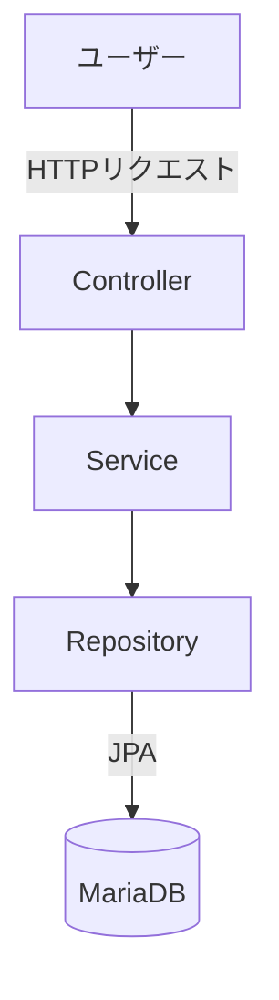
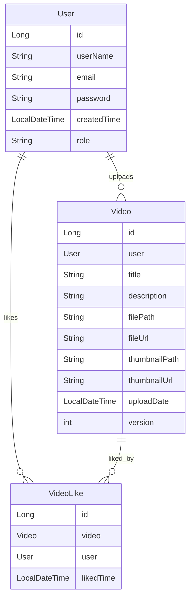

# 🎥 動画共有視聴システム (Video Sharing & Streaming System)

## 開発動機
このプロジェクトは、誰もが簡単に自分だけの動画ブログを作成し、共有できるようにすることを目的として始まりました。効率的な動画保存・ストリーミング機能の提供に加え、ユーザー体験を考慮したレコメンド機能やマイページなどの個別最適化機能の実装を目指しています。

## プロジェクト概要
本プロジェクトは、個人動画の保存およびストリーミングのためのWebアプリケーションです。ユーザーは動画をアップロードして管理できるほか、各動画に「いいね」を付けることも可能です。多言語対応やパフォーマンス最適化といった機能も提供しています。

## 技術スタック
	•	Java
	•	Spring Boot
	•	JPA（Hibernate）
	•	MariaDB
	•	Thymeleaf
	•	HTML / CSS / JavaScript
	•	Bootstrap 5

## 主な機能
	•	動画アップロードおよびストリーミング
	•	いいね機能および再生回数集計
	•	多言語（i18n）対応
	•	ユーザー認証および権限管理

## プロジェクト構成
```
video-main/
├── src/
│   ├── main/
│   │   ├── java/
│   │   │   └── hello/
│   │   │       └── video/
│   │   │           ├── VideoApplication.java
│   │   │           ├── configuration/
│   │   │           │   ├── LocaleConfig.java
│   │   │           │   ├── SecurityConfig.java
│   │   │           │   └── WebConfig.java
│   │   │           └── domain/
│   │   │               ├── User.java
│   │   │               ├── Video.java
│   │   │               ├── VideoLike.java
│   │   │               └── dto/
│   │   │                   ├── LikeRequestDTO.java
│   │   │                   └── UserLikeVideoResponseDTO.java
│   │   └── resources/
│   │       ├── templates/
│   │       └── static/
│   └── test/
├── build.gradle
├── gradle/
├── gradlew
└── settings.gradle
```

## アーキテクチャ


## ERD（エンティティ関連図）


## 担当業務および貢献度
	•	システム全体設計およびバックエンド実装
	•	動画アップロードおよびストリーミング機能開発
	•	ユーザー認証および権限管理機能開発
	•	ERD設計およびDBインデックス設計
	•	非同期アップロード機能の企画および実装中

## トラブルシューティング事例
	•	✅ 再生回数の重複増加問題：モバイルでリクエストが2回発生する現象を発見し、ログ分析によりリクエストタイミングを分岐処理して重複を防止
	•	✅ アップロード性能改善：大容量ファイルアップロード時にサーバーメモリ負荷が発生 → ファイルストリーム処理方式に変更し、容量制限チェック機能を追加

## デモリンク
	•	🔗 https://port-0-video-m8wpnu3bcb42614b.sel4.cloudtype.app/login

主な画面のスクリーンショット：
	•	ログイン画面

    •	ホーム画面
  
	•	マイページ動画一覧

	•	動画再生画面


## 実行方法
	1.	プロジェクトをクローンします。
	2.	MariaDBをインストールしてデータベースを設定します。
	3.	application.yml ファイルでDB設定を変更します。
	4.	以下のコマンドでプロジェクトを実行します：

```
./gradlew bootRun
```
## コントリビューション方法

改善点やバグの発見時には、自由にIssueを作成するか、Pull Requestを送ってください。

## 今後のアップデート予定機能
	•	🔍 検索機能の追加
	•	👍 いいねと再生回数に基づくレコメンド機能
	•	👤 ユーザーマイページ内の動画閲覧機能
	•	📝 動画説明のMarkdown記述機能
	•	🖼️ 動画サムネイルの自動生成機能
	•	📤 非同期通信によるアップロード進捗表示機能の改善

## 確認済みバグ・修正中の項目
	•	🌐 一部国際化対応が未完成（修正中）
