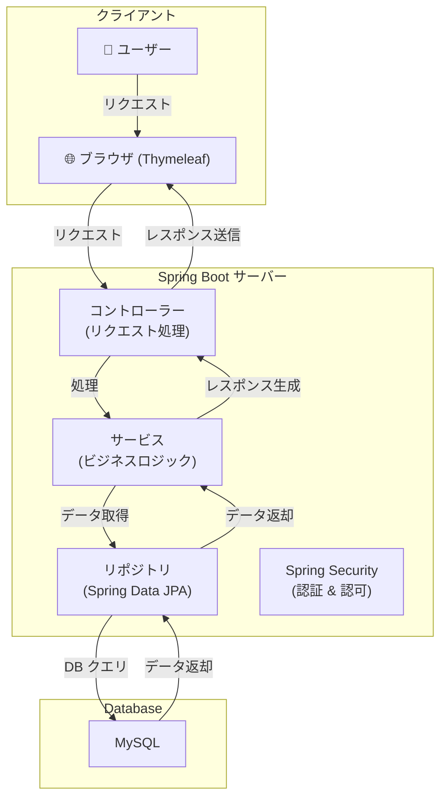
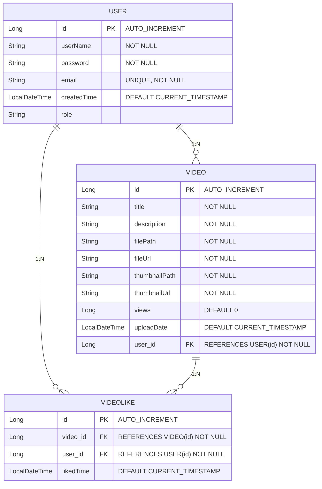

# 🎥 動画共有視聴システム (Video Sharing & Streaming System)

## 概要
本プロジェクトは、ユーザーが動画をアップロードし、他のユーザーと共有・視聴できる動画共有プラットフォームです。Spring Bootを用いて開発されており、ユーザー認証、動画管理、動画視聴、いいね機能などを提供します。

### このアプリの主な機能
- **動画アップロード**: ユーザーが自身の動画をアップロード可能
- **動画視聴**: 他のユーザーが投稿した動画を視聴可能
- **ユーザー認証 & ログイン**: Spring Security による安全な会員管理
- **いいね機能**: ユーザーが動画に「いいね」できる機能
- **動画検索機能（開発予定）**: タイトルや説明で検索可能な機能追加予定

---

## 技術スタック
| 分類        | 技術                 |
|------------|--------------------|
| **言語**   | Java 17             |
| **フレームワーク** | Spring Boot, Spring Security, Spring Data JPA |
| **テンプレートエンジン** | Thymeleaf |
| **フロントエンド** | Bootstrap, JavaScript |
| **データベース** | MySQL |
| **ビルドツール** | Gradle |

---

## アーキテクチャ

---

## データベース ERD

---

## セットアップ & 実行方法
### **1️⃣ 環境構築**
- JDK 17 以上をインストール
- MySQL (DB: `video_db`) をセットアップ
- `application.yml` にデータベース情報を設定

### **アクセス**
- **アプリ URL:** `http://localhost:8080`
- **管理者ユーザー:** 初期設定なし（DB で直接登録）

---

## スクリーンショット
### 로그인 & 회원가입
이 플랫폼은 반드시 회원가입이 필요합니다. 로그인을 위해 회원가입을 해줍니다.
[image]

회원가입이 완료 되면 로그인을 해줍니다.
[image]

### 홈화면
로그인을 하면 다른 맴버들이 업로드한 동영상을 전부 열람 가능하다
[image]

동영상 제목을 누르면 동영상을 시청할 수 있습니다.
[image]

### 마이페이지
마이페이지에서는 자신이 업로드한 동영상에 대한 관리를 할 수 있습니다.
[image]

동영상을 업로드 하기 위해서는 동영상을 업로드하고, 동영상 제목과 설명, 썸네일 사진을 업로드 합니다.
[image]

동영상을 업로드하면 내 동영상과 홈화면에 자신의 동영상이 표시됩니다.
[image]

동영상을 수정할 때는 제목, 설명, 썸네일만 수정가능합니다.
[image]

---

## 今後のアップデート予定
- ✅ **検索機能**: タイトルや説明で動画を検索できるようにする
- ✅ **コメント機能**: 動画にコメントを追加できる機能

